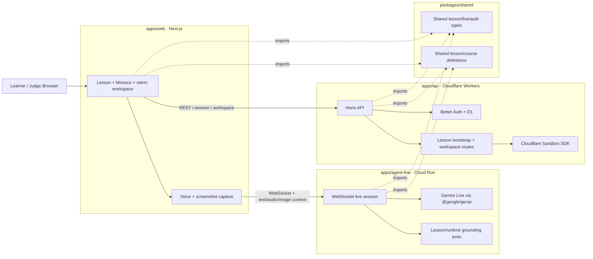

# Agent Tutor Architecture

This page is written for Gemini Live Agent Challenge judges.

`agent-tutor` is a coding workspace where the learner edits Python, runs real commands, and asks a live tutor for help. The tutor is grounded on the current lesson, the current code, the latest terminal output, and a screenshot of the visible workspace.

## What To Verify

- The learner-facing app is `apps/web`
- The lesson/runtime API is `apps/api`
- The live tutor runtime is `apps/agent-live`
- The live tutor backend is hosted on Google Cloud Run
- The coding workspace runs in Cloudflare Sandbox

## System Diagram

## End-To-End Runtime Flow

1. The learner opens `/app` in `apps/web`.
2. `apps/web` requests a lesson workspace from `apps/api`.
3. `apps/api` boots a disposable Python workspace in Cloudflare Sandbox and returns:
   - lesson context
   - starter files
   - terminal/runtime snapshot
4. The learner edits code in Monaco and runs commands in xterm.
5. When the learner asks for help, `apps/web` sends the live tutor:
   - lesson grounding
   - current source code
   - latest command
   - latest stdout/stderr
   - screenshot of the visible workspace
   - audio or text input
6. `apps/agent-live` enriches the turn and forwards it to Gemini Live.
7. Gemini Live responds with transcript and audio output.
8. `apps/web` renders the tutor response in the learning rail.

## Why This Architecture Matters For Judging

This architecture is important because the tutor is:

- live
  - real-time WebSocket session, not a basic request/response chat box
- multimodal
  - hears the learner
  - speaks back
  - receives the visible workspace as an image
- grounded
  - lesson context
  - current code
  - latest command
  - terminal stdout/stderr
  - screenshot of the current workspace
- challenge-aligned
  - Gemini Live through the Google GenAI SDK
  - live-agent backend hosted on Google Cloud Run

## Code Pointers

If you want to inspect the main surfaces directly:

- Web workspace:
  - `apps/web/src/features/live-mentor`
- Workspace bootstrap and sandbox execution:
  - `apps/api/src/modules/lesson/workspace`
- Live tutor entrypoint:
  - `apps/agent-live/src/index.ts`
- Gemini Live session creation:
  - `apps/agent-live/src/workflows/createLiveTutorSession.ts`
- Shared lesson/live contracts:
  - `packages/shared/src`
